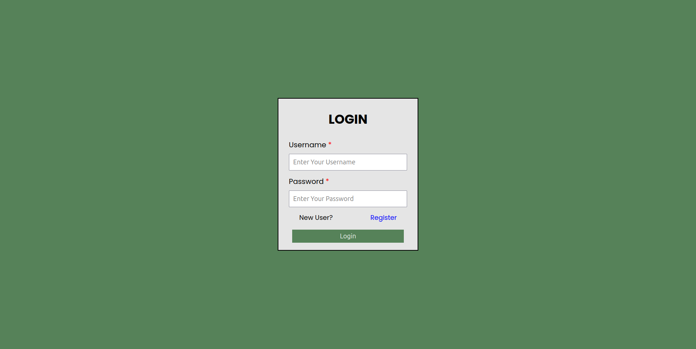
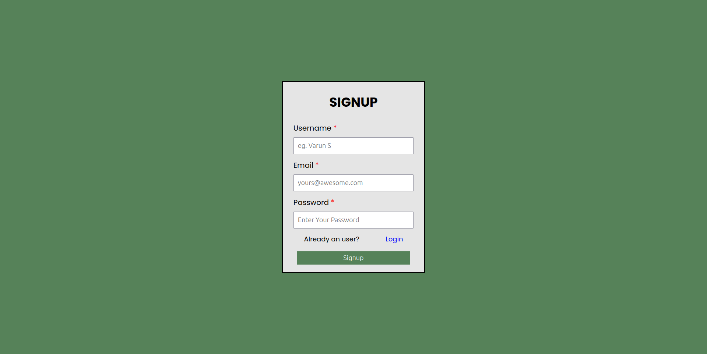
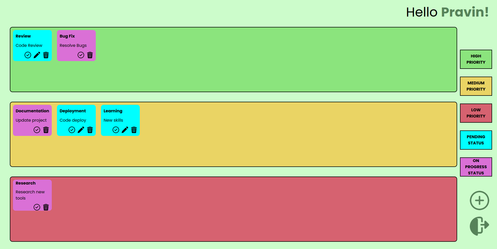
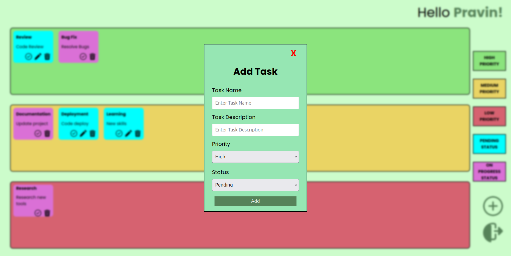

### Description

A Full Stack Web Application built with MERN Stack involving the combination of people who look for taking the notes for doing daily tasks and to achieve thier goals daily.

### Flow of Application

-   Users

    -   Register
    -   Login
    -   Explore the tasks with priority, then the status will be explored by the user's convinience
    -   After adding the task, the process of updated or completed task status will be explored by the user's choice
    -   Logout

### Tech Stack and Tools used

```
Front-End:
- HTML
- SCSS
- JS
- React

API:
- Express JS

Server-side:
- MongoDB

Testing:
- Postman

Design:
- Figma

Version control:
- Git
- Github
```

### Specifications

```
Browser specs:
- Resolution : 1920 x 1080 / 1920 x 1200
- Zoom : 100%
- Running OS : Ubuntu
- Recommended Browser : Firefox, Opera, Chrome
```

### Screen Shots

Login Page



Signup Page



Dashboard Page



Adding Tasks



### Contact

Pravin R K

<a href="mailto:rkpravin2003@gmail.com">Mail</a>
